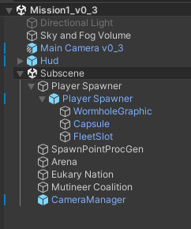

# LSSS Breakdown

LSSS looks like a huge high-performance highly-optimized game that is difficult
to understand and navigate. In reality, it is much more simple than that, and
the sheer number of assets present are simply due to granular organization and
good practices.

This guide will break down the project into its various parts and provide some
brief explanations for how everything fits together. The goal of this guide is
to make it easier to navigate the project and learn from it.

It is assumed you have already played the game from the title screen and have
explored some of the missions and settings. If not, please do so first. You can
do this by entering *Assets/Scenes/Title and Menu* and pressing play.

## Entity Archetypes in a Mission

A mission in LSSS is completely self-sufficient. Any mission scene can be
entered into play mode without having to go through the menus. Every mission
looks roughly like this:

The version number associated with each mission correlates to the Latios
Framework version the mission was added. In-game, it correlates to the Sector on
the Mission Select screen.

### Factions

In the screenshot above, Eukary Nation and Mutineer Coalition are factions. Each
faction has a single faction Entity at runtime which keeps track of
reinforcements as well as how many ships of their faction are allowed to be
spawned into the world at a time. A faction also stores the ship prefabs, both
for player and AI.

Only one faction is the scene will ever have a populated player ship prefab.
That faction also likely has mission objectives, which specify the mission end
criteria.

The Spawn Weight Inverse field specifies a relative priority of ship spawning in
a global priority queue.

### Ships

Ships in LSSS are always prefabs. Ships can do many different things, such as
drive forward and backwards, turn, boost, and fire their weapons. Most of the
ship’s child objects are just meshes with collider shapes, combined into a
single CompoundCollider via the Custom Collider component on the root. However,
there are three special types of children worth identifying. The first is the
Camera Mount, which is what the camera attaches to when the ship is controlled
by the player. The second are the gun tips, which is where bullets spawn. The
third is the AI radar, which for AI ships dictate how an AI ship perceives other
ships.

Ships also contain several prefabs. There is a prefab for the explosion they
produce when destroyed. There is a prefab for the bullets they fire. And there
is a prefab for the effects they produce whenever they fire. At the time of
writing, these effects are purely audio effects, but they could also include
muzzle flashes in the future. Ships also have Hit Effect prefabs, but no effects
exist for these at the time of writing.

If the ship is a player ship, it will have the Player component. Otherwise, it
will have the AI Brain component as well as one or more AI modules which add
behavior to the ships. For any parameter that has both min and max values, the
actual value is a randomly-generated value within this range at spawn time.

Ships use a global y axis for pivoting left and right to avoid rolling when
steering in a diagonal direction.

### Camera

The Camera Manager and the main camera combine via the GameObjectEntity feature
into a single entity at runtime. It not only contains the Myri Listener, but it
also contains a set of draw distances, with the appropriate distance being set
based on the quality settings of the game.

### Sound Effects

All sound effects are procedurally generated at bake time using USFXR. This is
why none of the Myri Audio Sources have a clip populated. Instead, the Sound
Effect uses the Myri Smart Blobber API to create the clip procedurally and add
it to the runtime audio source.

Yes, I know there’s no sound in space. But sound makes the game more fun.

### Bullets

Bullets are what ships shoot. They always fly in a straight line. And if they
travel for too long without hitting anything, they dissipate. Their collider
shape is always a capsule.

### Explosions

Explosions are simple spheres that grow up to their maximum radius, and then
after some time dissipate. Ships caught in an explosion will take significant
damage and likely be destroyed themselves, creating a chain reaction.

Explosions contain several sound effect prefabs, each set with different audible
ranges and falloff curves. This creates a unique effect where distant explosions
can only be heard as a low rumble, while nearby explosions will also generate
high-pitched crackles.

### Arena

The Arena gets merged into the Scene Blackboard Entity and specifies the extents
of the playable area for the mission.

### Spawn Proc Gen

This is an entity in each mission that procedurally generates orbital spawners
in the world. It dictates the number of spawners as well as ranges for random
parameters.

### Orbital Spawners

An orbital spawner is an entity that flies around in a circular path, and
sometimes stops with a random orientation to spawn a ship. An effect is created
and animated before the ship is released.

When a faction detects that the world contains less ships from its faction than
its specified maximum, and it has reserve reinforcements, it will spawn disabled
ships and add them to the global queue. An orbital spawner will dequeue a ship
only when it is not currently in the process of spawning a ship and when nothing
in the world is within a radius of it. Orbital spawners make the spawn locations
of ships less predictable.

### Fleet Spawners

Fleet spawners are special spawners which only activate at the start of the
mission and must be manually authored. They are currently used to spawn the
player is Sector 03 missions. A fleet spawner must have 1 or more slots where a
ship can be spawned from.

### HUD

This is all the overlay graphics for the player. It is a self-hosted
GameObjectEntity.

### Player-Stolen AI Ship

If a player-controlled faction is out of reinforcements when the player’s ship
is destroyed, but there are other ships in the faction out in combat, the player
will be given control of the ship with the highest health. The player might also
end up stealing a queued up AI ship yet to be spawned.

### Unused Types

The LSSS codebase contains logic for additional Walls which are solid structures
that stop ships and bullets, and wormholes which allow ships and bullets to
teleport. At the time of writing, these features are unused as the AI ships do
not know how to navigate them.

## Mission Game Loop

LSSS uses the n-1 rendering feature of Latios Framework. This changes the root
level system order to instead be Initialization, then Presentation, and finally
Simulation. The advantage of this technique is that rendering happens right
after spawns and despawns in the `InitializationSystemGroup`.

LSSS also uses Explicit System Ordering, in which `RootSuperSystems` order
themselves to Unity and framework systems via attributes, but then explicitly
specify the order of the remaining systems in a top-down hierarchical manner.
You can find all of these `RootSuperSystems` in
Assets/_Code/SuperSystems/LsssRootSuperSystems.cs.

### Pre Transforms

The `LsssPreTransformRootSuperSystem` executes in the `SimulationSystemGroup`
before transforms update. This system is responsible for stepping the positions
and rotations of all the entities.

Every ship has a `ShipDesiredActions` component, which provides a common
interface for both player and AI to control the ship. For the player, input is
read in a system before the actions are applied. AI ships compute their actions
a frame in advance.

Ships move and turn. Bullets fly straight. Explosions grow in scale. And orbital
spawners fly in their circle if they aren’t in a pause state to play the spawn
animation.

### Post Transforms

Once the transforms have been updated, LSSS builds Psyshock collision layers for
ships, bullets, explosions, and spawn points. The later three are saved to the
Scene Blackboard Entity for future logic. For ships, a layer is built for each
faction and saved to the faction entity instead.

Next, the AI systems execute, evaluating the modules and sensors. The radar
sensing system is by far the most complicated, performing a complex series of
Psyshock operations in order to find enemy targets to shoot at while also
avoiding friendly fire.

After AI, the jobified gameplay systems which don’t modify transforms run. These
include the collision detection for bullets, explosions, and ships. These also
include other update logic such as spawner dequeuing, bullet firing, destroying
ships with no health, evaluating mission status, and updating the expiration
timers of bullets, explosions, and other effects.

Lastly, some systems which update presentation effects are executed, such as
snapping the camera to the player ship’s camera mount, and updating the
animation of spawners.

### Latios World Sync Group

In the `LatiosWorldSyncGroup` inside `InitializationSystemGroup`, the systems
responsible for spawning and enabling ships execute. Additionally, this is when
the Spawn Proc Gen kicks in on the first frame.

After these structural changes, the `TransformSuperSystem` is asked to run to
initialize newly spawned entities to have valid transforms.

### Presentation

One last group runs before rendering which is responsible for miscellaneous
presentation things, such as updating the material properties of entities that
dissipate, updating the Myri listener and camera draw distances based on
settings, and updating the UI (including main menu and mission finished UIs).
